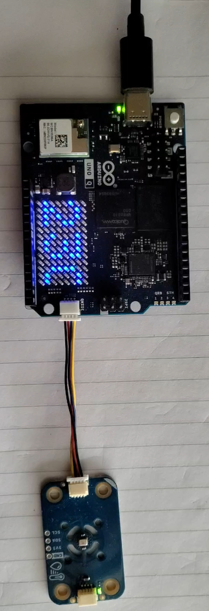

# 🌡️ Temperature2
This app uses a Modulino Thermo to get the temperature in Celsius, and present it on the built in LED Matrix.
The Python backend periodically pulls the temperature (in both C, and F) and the humidity from the device, storing it in a Time Series DB (InfluxDB). The web interface then shows current, and historic data.



## Web Interface
The Python application serves a responsive web dashboard at `http://<localhost>:7000/`.


- **Displays**: Current temperature (in both °C and °F), current humidity, and the time of the last measurement.
- **History Chart**: A real-time updating chart showing temperature and humidity data over a user-selectable history range (2 to 24 hours, automatically refreshed every 5 minutes).
- **Controls**: A floating Settings modal allows users to change the temperature units (°C or °F) displayed on the physical Modulino LED matrix and adjust the history chart range.

## Python API
The Python code exposes a REST API on port 7000 to fetch data and control the device:
- `GET /temp`: Returns the most recent sensor readings and a UTC timestamp. Example: `{"timestamp_utc": "...", "celsius": 24.5, "fahrenheit": 76.1, "humidity": 45.2}`
- `GET /history?hours=4`: Returns historical sensor data from the time series database for the specified number of hours. Example: `{"hours": 4, "count": 12, "samples": [...]}`
- `GET /units`: Gets the temperature unit currently displayed on the hardware. Example: `{"units": "F"}`
- `GET /setUnits`: Toggles the hardware display unit between Celsius and Fahrenheit. Returns the newly set unit. Example: `{"units": "C"}`
- `GET /interval`: Gets the current background polling interval in seconds. Example: `{"intervalInSeconds": 300}`
- `GET /setInterval?interval=300`: Sets the background polling interval in seconds. Example: `{"intervalInSeconds": 300}`

## Internal Hardware Interface
- The Python program routinely pulls temperature and humidity metrics from the sketch by calling `get_sensor_data` via the Bridge.
- The Python program can choose if the displayed temperature on the hardware will be in C or F by calling `set_device_units` via the Bridge.

## Database
The application uses an InfluxDB time series database to persistently store historical metrics. This is managed via the `TimeSeriesStore` brick.

- **Measurement Name**: All data is recorded under the `weather` measurement (collection).
- **Stored Metrics**: The database logs three separate measures during each polling interval: `celsius`, `fahrenheit`, and `humidity`.
- **Data Structure**: When accessed via the Python interface (such as by the `/history` API), the individual measures are queried and merged by their shared millisecond Unix timestamp. The resulting data is structured like this:

```json
[
  {
    "timestamp": 1715000000000,
    "celsius": 24.5,
    "fahrenheit": 76.1,
    "humidity": 45.2
  }
]
```

## Dependencies
The sketch uses the following libraries:
1. Arduino_LED_Matrix (built in) - to control the LED matrix
1. Arduino_Modulino - to communicate with the Modulino thermo
1. Arduino_BridgeRouter - to communicate between Pyhon and the board
1. Arduino WebUI brick - to expose the web UI and API
1. Arduino Database Time Series brick - InfluxDB container and interface
