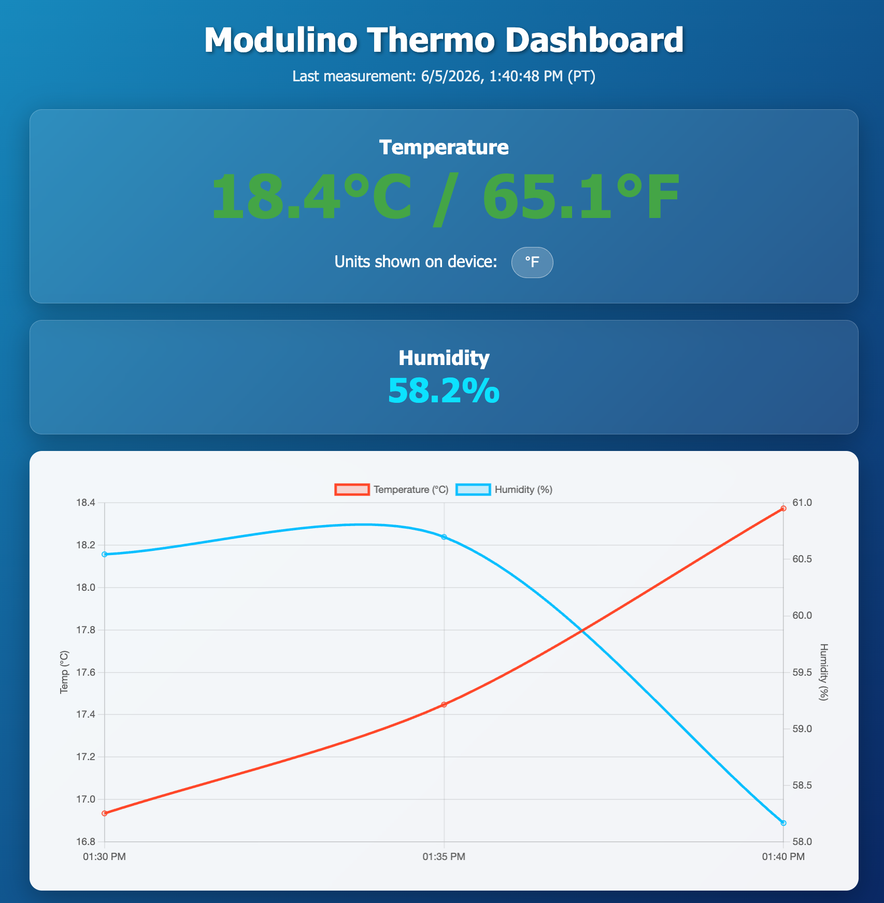

# 🌡️ Temperature2
This app uses a Modulino Thermo to get the temperature in Celsius, and present it on the built in LED Matrix.
It then sends the temperature (in both C, and F), and the humidity back to Python, to be stored in a Time Series DB (InfluxDB). The web interface then shows current, and historic data.

## Web Interface
The Python application serves a responsive web dashboard at `http://<localhost>:7000/`.

- **Displays**: Current temperature (in both °C and °F), current humidity, and the time of the last measurement.
- **History Chart**: A real-time updating chart showing the last 4 hours of temperature and humidity data (updated every 10 minutes).
- **Controls**: A toggle button allows users to change the temperature units (°C or °F) displayed on the physical Modulino LED matrix.

## Python API
The Python code exposes a REST API on port 7000 to fetch data and control the device:
- `GET /temp`: Returns the most recent sensor readings and a UTC timestamp. Example: `{"timestamp_utc": "...", "celsius": 24.5, "fahrenheit": 76.1, "humidity": 45.2}`
- `GET /units`: Gets the temperature unit currently displayed on the hardware. Example: `{"units": "F"}`
- `GET /setUnits`: Toggles the hardware display unit between Celsius and Fahrenheit. Returns the newly set unit. Example: `{"units": "C"}`

## Internal Hardware Interface
- The sketch sends temepratures and humidity to the Python program by calling `updateTemperature`
- The Python program can choose if the displayed temperature will be in C or F by calling `setDegrees`

## Dependencies
The sketch uses the following libraries:
1. Arduino_LED_Matrix (built in) - to control the LED matrix
1. Arduino_Modulino - to communicate with the Modulino thermo
1. Arduino_BridgeRouter - to communicate between Pyhon and the board
1. Arduino WebUI brick - to expose the web UI and API
1. Arduino Database Time Series brick - InfluxDB container and interface
